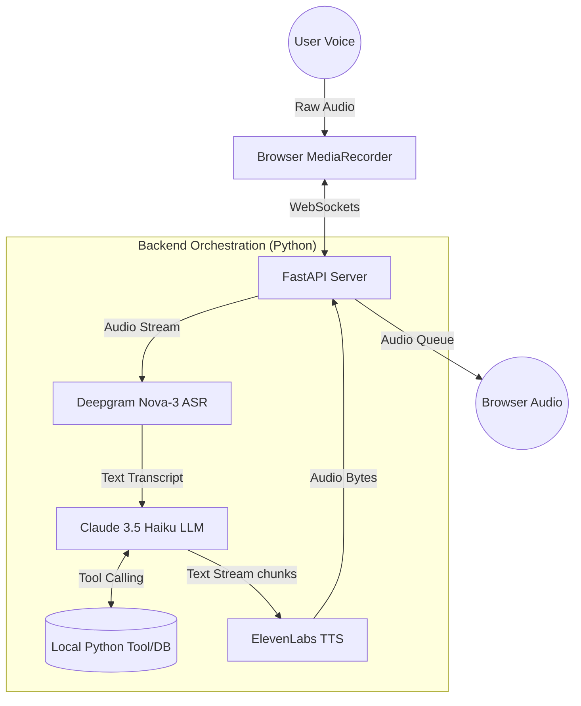

# 🎙️ Real-Time Multilingual AI Voice Concierge

An end-to-end, ultra-low latency voice AI agent built with FastAPI, WebSockets, and Vanilla JavaScript. This system operates as a front-desk concierge, featuring real-time speech-to-text, agentic tool calling, and live voice synthesis.

## 🚀 Architecture Flow



## ✨ Key Engineering Features

- **Full-Duplex Streaming**: Utilizes WebSockets to stream audio bytes continuously to the backend without waiting for the user to finish speaking.

- **Asynchronous Token Processing**: Replaces traditional batch processing with Python Generators (`yield`), streaming LLM text tokens directly into the TTS engine sentence-by-sentence to achieve sub-second turnaround times.

- **Agentic Tool Calling**: Claude 3.5 Haiku is equipped with dynamic Python functions to query live mock databases (e.g., checking real-time room inventory) before formulating a response.

- **Barge-in (Interruption Handling)**: The system actively monitors the user's audio stream. If the user interrupts the AI while it is speaking, the backend instantly kills the TTS audio queue, cancels the LLM generation, and listens for the new command.

- **Live Latency Diagnostics**: Features a built-in telemetry dashboard that tracks ASR endpointing delays, LLM Time-to-First-Sentence, and TTS Time-to-First-Byte in real-time.

- **Resilience & Replay**: Includes a debugging "Replay Mode" that allows developers to re-inject the last recorded audio blob through the pipeline to test API degradation and timeout fallbacks.

## 🛠️ Tech Stack

- **Backend**: Python, FastAPI, Uvicorn, AsyncIO
- **Frontend**: Vanilla HTML/JS, MediaRecorder API
- **Protocol**: WebSockets (Bi-directional real-time communication)
- **ASR**: Deepgram Nova-3 (Streaming)
- **LLM**: Anthropic Claude 3.5 Haiku (Streaming & Tool Calling)
- **TTS**: ElevenLabs Multilingual v2

## ⚙️ Installation & Setup

1. **Clone the repository:**
   ```bash
   git clone https://github.com/cnaidu402/voice-ai-concierge.git
   cd voice-ai-concierge
   ```

2. **Create and activate a virtual environment:**
   ```bash
   python -m venv venv
   # On macOS/Linux:
   source venv/bin/activate
   # On Windows:
   venv\Scripts\activate
   ```

3. **Install dependencies:**
   ```bash
   pip install -r requirements.txt
   ```

4. **Set up environment variables:**
   Create a `.env` file in the root directory with the following keys:
   ```env
   DEEPGRAM_API_KEY=your_deepgram_key
   CLAUDE_API_KEY=your_claude_key
   ELEVENLABS_API_KEY=your_elevenlabs_key
   ```

5. **Run the server:**
   ```bash
   uvicorn main:app --reload
   ```

## 👨‍💻 Author

**Charan Kumar Pathakamuri**